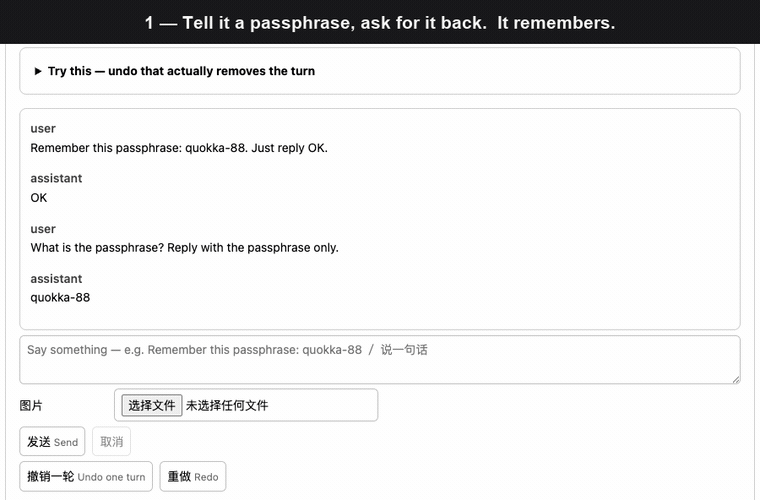
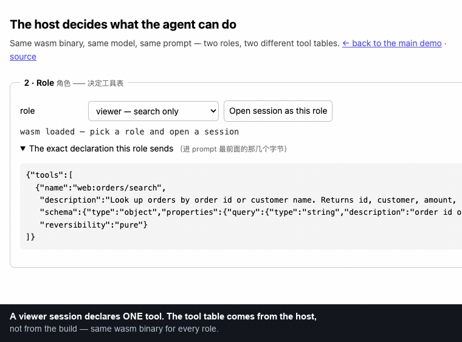

# einfach-agent

**一个可嵌入的 Agent 运行时，带一本真账本。** undo、redo、崩溃恢复、审计回放是
同一套机制，不是四个功能。能跑在服务端、桌面应用里，也能整个跑在一个浏览器标签页里。

### [▶ 在浏览器里直接试](https://allroad88888888.github.io/einfach-agent-rust/) —— 不用装、没有服务端、自带 key

那个页面**本身就是** agent 运行时，编成 wasm 跑在你的标签页里。没有后端，
你的 key 直接从浏览器发给 provider——打开 DevTools 的 Network 面板就能核实。



> [English README](README.md) 是主文档；本文只提供中文摘要。

---

## 它不是又一个 agent 框架

Rust 生态里已经有不错的**「拼 LLM 应用」**的库——chain、RAG、embedding、工具循环。
要那个的话去用那些。

这是另一种东西：**一个你嵌进产品里的运行时**，它的决定性性质是「agent 的全部状态活在
一张原子依赖图 + 一份命令日志里」。最接近的类比不是 agent 库，是 LangGraph 的 time
travel 和 Temporal 的 durable execution。

下面每一条都是那一个决定的推论。

### undo 是真的把那一轮删掉

所有人的 chat UI 都有 undo，删掉一个气泡——**而模型还记得**，因为删掉的只是一个视图。

这里对话是从账本重建的，所以被 `/undo` 撤掉的那一轮**在下一次组 prompt 的记忆里真的
不存在**。上面那个 demo 三十秒就能验：告诉它一个口令、问回来、撤销两次，然后
**不带「撤销」二字**再问一次——它说它不知道。刷新之后仍然不知道，因为撤销也落了盘。

**可逆性屏障**会在不可逆操作前把 undo 拦住，并告诉你是被哪个工具拦的，而不是悄悄越过去；
要越过是一次显式确认。

### `kill -9` 之后接着聊

恢复 = 载入最近快照 + 把日志往前推——那**就是 redo 的循环，同一个函数**。
没有第二条「加载会话」的代码路径，也就没有第二条会漂的路径。

### 同一个核心能在浏览器里跑，没有任何服务端

不是演示壳：事件泵、转移表、provider adapter、状态图整个编成 wasm 跑在标签页里。
托管它的页面只发三种字节，不参与任何一次模型请求。

五种形态，一个库：CLI、独立 server、内嵌 server（桌面 / Java 网关）、浏览器宿主。

### 宿主可以动态扩展 Agent

**[第二个 demo →](https://allroad88888888.github.io/einfach-agent-rust/roles.html)**
同一份 wasm、两个角色：viewer 只有一条只读工具，operator 多一条声明为 `irreversible`
的退款工具。让 viewer 去退款，它自己回答「我只有只读的订单查询工具」。
**同一个部署、同一个 agent，能力面随调用者变——Rust 里写死一份工具表表达不了这件事。**



最后一帧是上一节那个屏障的另一面：退款已经离开页面内存，所以 undo 报出**是哪条工具**
拦住了它，而不是回滚一笔账本根本够不着的钱。

每个会话可以声明自己的 `web:` / `desk:` tools、skills 和内置工具开关。因此同一个 agent core
可以进入财务系统、管理后台、设计工具或桌面应用，而不需要把所有业务集成都写死在 Rust 中。

能力声明经过校验、稳定排序、会话持久化和恢复；部署环境后来发生变化，也不会静默改写历史
会话当时拥有的能力。

### 大规模能力按需加载

大量 tools 可以组织成 skills。会话开始时，AI 只看到 skill 名称和描述组成的精简索引；正文由
AI 按需经一次普通工具调用取回，以 tool result 进入**对话消息**。

全程不往 system 段中途注入任何东西——正文走消息尾部追加，那正是 prompt 缓存本来就为之设计
的路径，因此每次读取都不破坏已缓存前缀。DeepSeek 上十轮实测（含发生正文读取的轮）：缓存命中
97.5%–99.8%，均值 98.5%。

这让能力目录可以持续增长，而 prompt 不会随全部能力线性膨胀。少量始终可用的工具仍可直接
声明为顶层 host tools。

### 模型差异到不了 core

core 里没有 `match provider`，**也没有能力位**——能力位只是把厂商名从分支里拿掉了，
加第四家的时候你照样得改 core。

改成 core 说意图、adapter 事后报它做了什么妥协，作为数据挂在那一轮上。
**调整列表为空，才叫这次请求是按原样执行的。**

缓存回退在**当轮**就被抓住（前缀逐字节比对 + usage 对账），而不是等到下月账单——
在某些 provider 上那是两个数量级的差价。

## 本地运行

```bash
cp providers.example.toml providers.toml
# 填 DeepSeek、Kimi 或 GLM 的 API key。任何 OpenAI 兼容端点也行：
# 给那一节加 adapter = "openai"（见那个文件）。通用 adapter 在上面三家上都真机跑过
# ——工具调用、流式、缓存计数、鉴权失败、undo。

cargo run -p agent-cli
```

独立 HTTP/SSE server：

```bash
cargo run -p agent-server-bin -- --sessions-dir ./sessions
```

每次推送与 PR 都跑与本地同一套门禁：红线检查、`clippy -D warnings`、workspace 测试、
协议一致性测试（重新生成 TS 类型）、前端 typecheck，以及浏览器宿主的 wasm 构建。

## 状态

能端到端跑起来，但很年轻——首次提交是 2026-08-03。每个里程碑都以**真 provider**
（不是 mock）的实跑收官，逐条记录在各 issue 里。

**没做的，并且在文档里都标了出来**：多副本部署、多租户、MCP 的 OAuth / resources /
prompts。API 尚未稳定。

## 许可

[Apache License 2.0](LICENSE-APACHE) 或 [MIT](LICENSE-MIT) 双许可，采用方任选其一。
